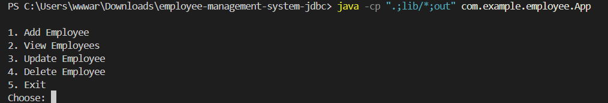
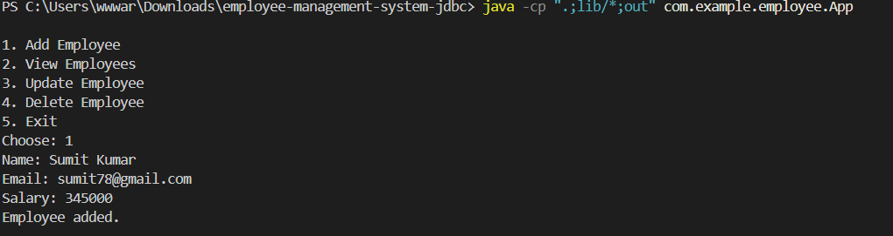
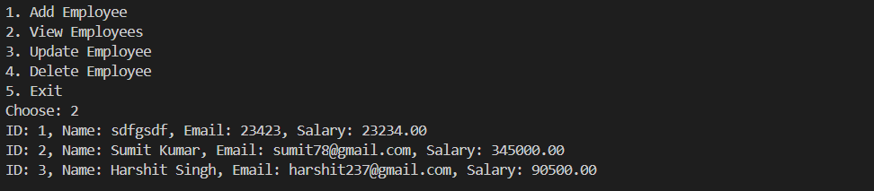
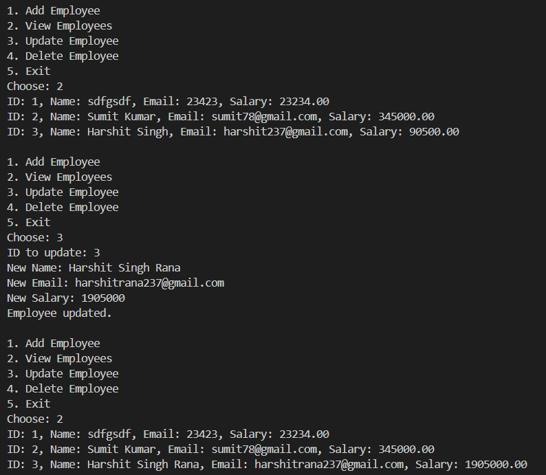
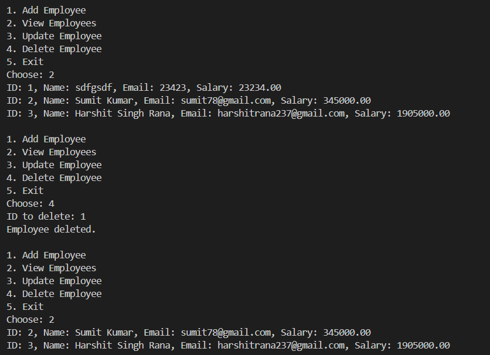
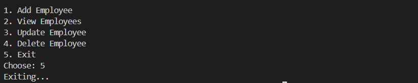

# Employee Management System JDBC

A simple Java console application to manage employees using JDBC with MySQL. Supports CRUD operations (Create, Read, Update, Delete).


## Features

This Employee Management System JDBC application helps in managing employee records using a relational database. Here are the detailed features:

- **Add Employee:**
   - Enter employee details (name, email, salary) via a user-friendly console menu.
   - Data is securely inserted into the database using parameterized SQL (PreparedStatement) to prevent SQL injection.

- **View Employees:**
   - Retrieve and display all employee records from the database in a clear, tabular format.
   - Each record shows the employee's ID, name, email, and salary.

- **Update Employee:**
   - Select an employee by ID and update their name, email, or salary.
   - Changes are saved directly to the database, with confirmation messages for success or failure.

- **Delete Employee:**
   - Remove an employee record by specifying the employee's ID.
   - The application confirms deletion and handles cases where the ID does not exist.

- **Database Connectivity:**
   - Uses JDBC with externalized configuration for database URL, username, and password.
   - Supports both MySQL and PostgreSQL (just update the driver and connection string).

- **Industry-Standard Practices:**
   - Clean separation of concerns: model, DAO, utility, and main app classes.
   - Uses try-with-resources for safe resource management.
   - All SQL operations use PreparedStatement for security and efficiency.

## Project Structure

```
employee-management-system-jdbc/
├── src/
│   └── main/
│       └── java/
│           └── com/
│               └── example/
│                   └── employee/
│                       ├── App.java                # Main application 
│                       ├── dao/
│                       │   └── EmployeeDAO.java    # Data access 
│                       ├── model/
│                       │   └── Employee.java       # Employee entity
│                       └── util/
│                           └── DBConnection.java   # Database 
├── lib/               # JDBC driver
├── out/               # Compiled classes and runtime resources
│   └── application.properties   # DB configuration (used at runtime)
├── screenshots/       # Screenshots for documentation
│   ├── menu.png
│   ├── add_employee.png
│   ├── view_employees.png
│   ├── update_employee.png
│   ├── delete_employee.png
│   └── exit.png
├── .gitignore
└── README.md
```

## Setup & Run
1. **Download JDBC Driver:**
   - MySQL: [mysql-connector-java](https://dev.mysql.com/downloads/connector/j/)
   - Place the jar in the `lib/` folder.
2. **Configure Database:**
    - Create a database and `employee` table.
    - Update `out/application.properties` with your DB details.
3. **Compile:**
    - If you are using Windows PowerShell or Command Prompt, run:
       ```sh
       javac -cp ".;lib/*" -d out src/main/java/com/example/employee/App.java src/main/java/com/example/employee/dao/EmployeeDAO.java src/main/java/com/example/employee/model/Employee.java src/main/java/com/example/employee/util/DBConnection.java
       ```
    - This will compile all Java files and place the class files in the `out` directory.

4. **Run:**
    - Make sure `application.properties` is present in the `out/` directory.
    - Then run:
       ```sh
       java -cp ".;lib/*;out" com.example.employee.App
       ```


## Screenshots

Below are the key operations with example screenshots, in the recommended order:

### 1. Application Menu

<br>
This screenshot presents the main menu of the application, where users can choose to add, view, update, or delete employees, or exit the program.

### 2. Add Employee

<br>
This screenshot shows the process of adding a new employee by entering their name, email, and salary in the console menu.

### 3. View Employees

<br>
This screenshot displays the list of all employees currently stored in the database, including their ID, name, email, and salary.

### 4. Update Employee

<br>
This screenshot demonstrates updating an existing employee's details by providing their ID and new information.


### 5. Delete Employee

<br>
This screenshot shows the deletion of an employee record by entering the employee's ID.

### 6. Exit

<br>
This screenshot shows the application after the user selects the exit option, confirming the program has closed successfully.

## Author
Arpit Yadav